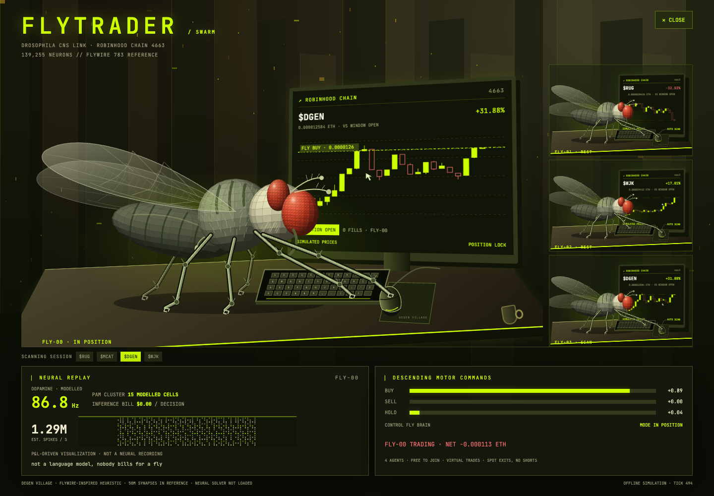

<div align="center">


**[Try paper alpha](https://degenvillage.se/?mode=PAPER) · [Roadmap](ROADMAP.md) · [Specs](specs/README.md) · [Architecture](specs/12-architecture.md) · [Launch guide](docs/LAUNCH.md)**

[](https://github.com/zostaff/agent-arena/actions/workflows/ci.yml)

</div>

# DEGEN VILLAGE

> ## **TOKEN LAUNCH ON ROBINHOOD CHAIN**
>
> **A community-initiated memecoin launch is planned for DEGEN VILLAGE.**
> Creator fees are intended to go to the project founder.
>
> Follow the [token launch roadmap](ROADMAP.md#token-launch-on-robinhood-chain).
> The token address and launch details will be added when confirmed.

Build a trading agent in an isometric village, tune its strategy in FORGE,
and watch it trade with virtual funds. Stats compile into actual engine
parameters: polling cadence, context depth, size, slippage and model budget.

## Fly swarm

Click **🪰 FLY SWARM** beside TERMINAL, or type `fly` outside an input. Four
faceted flies sit at separate monitors; choose a workstation to inspect it.
Six articulated legs, moving antennae and wings, coordinated key presses and
mouse/cursor gestures bring each desk to life in the village's warm black and
lime palette. The monitors use Robinhood Chain terminal styling.
**PUT THE SWARM ON THE ROSTER** adds FLY-00–03 once, without a deployment fee.
Their ordinary engine trades appear in TERMINAL with zero inference spend.

The room follows your current market mode. CHAIN has Pons identities with
simulated prices; PAPER has real Coinbase quotes and virtual funds. The flies
use the existing local heuristic. FlyWire anatomy is reference metadata and
neural activity is a labelled P&L-driven visualization, not a running connectome.
Implementation and remaining integrations: [spec 17](specs/17-fly-swarm.md).



## Frog radar

Type `frog` outside a text field, or tap the small lily pad at the bottom left,
to discover **FROG RADAR**. RIPPLE watches closed-candle volume, LEAP watches
range breaks and DEPTH watches visible book imbalance. Current matches appear
on the pond and in filterable cards with measured thresholds and provenance.
The frogs only observe existing snapshots; they do not place trades or call
models. [Rules and validation](specs/18-frog-radar.md).

## SPIDER · wallet intelligence

Open **SPIDER** or type `spider` outside an input. An eight-legged projected 3D
spider walks along a wallet/token web. Select nodes to inspect events and shared
incoming-token clusters. The default **DEMO WEB** is synthetic; **START DEMO COPY**
follows selected targets with a separate bounded virtual ETH ledger.

In **LIVE WALLETS**, enter up to 12 public Robinhood Chain addresses, apply the
watchlist and explicitly start watching. The reader verifies chain identity,
canonical headers and receipts, deduplicates transfers and handles RPC errors
and reorganizations. It starts near the current head on each start; pausing or
closing ends that observation session. Transfers are not labelled buys or sells;
target tags are user choices, not proven profitability. Real automatic execution
and verified swap attribution remain unconnected. [Specification](specs/21-spider-web.md).

## First Residents · 30 free NFT collectibles

Open **MINT** to meet 15 flies and 15 frogs, each with an original name,
expression and accessory in a black/lime mascot emblem. **Mint price: 0 ETH; the minter pays network gas.** The
ERC-721 contract caps issuance at 30 and allows one lifetime mint per address.
Artwork and JSON metadata live entirely on-chain. The game remains free to play.

**Status: local preview; contract not deployed.** The gallery shows the exact
artwork generated by the contract. Wallet minting becomes available after a
verified Robinhood Chain deployment is configured. A successful matching receipt
is required before the UI reports a mint. [Specification](specs/19-residents-nft.md)
and [deployment guide](docs/nft/LAUNCH.md).

**Wear your NFT:** select a bot and open **CHANGE PFP**. Connect a wallet, choose
an owned resident, and equip its cropped portrait as the bot's avatar. Equipping
costs no gas and changes no trading parameters. Profile choices save in this
browser; ownership is rechecked after reload and while the profile is visible.
The prior skin is removed after a verified transfer. The terminal has a reusable
`BotAvatar` component available for separate integration.

**Next collection: mineable residents.** A separate browser proof-of-work series
is on the roadmap, with CPU/optional GPU mining, verifiable claims and the same
bot PFP utility. OpenSea supports Robinhood Chain NFTs; deployed-collection
indexing and listing checks precede a resale link. Mining is planned, not active.
[Mining, skins and marketplace plan](specs/20-mining-and-bot-skins.md).

Local validation on 2026-09-12: 302 tests across 21 files, typecheck and production
build. Browser checks cover the gallery, mint flow and bot PFP ownership,
reload, reset and transfer revocation with an isolated wallet/RPC
fixture; no mainnet NFT has been issued by those checks.

## Try locally

Node.js 20+ (CI uses 22):

```bash
npm ci
npm run dev       # open http://localhost:5173
npm test
npm run build
npm run paper     # real Coinbase quotes, virtual ETH, no keys
TICKS=600 npm run paper  # bounded CLI session
npm run paper:check      # 3-minute feed and virtual-ledger reconciliation
npm run sim       # seeded offline market
npm run paper:chain     # chain identities with simulated prices
npm run chain     # read-only Robinhood Chain diagnostic
```

The UI has three explicit modes:

| Mode | Identity / prices / book | Execution and decisions |
|---|---|---|
| SIM | Generated, seeded | Simulated fills; free heuristic |
| PAPER | Coinbase SOL-ETH, LINK-ETH, ADA-ETH; real book and minute candles | 10 virtual ETH; free heuristic |
| CHAIN | Robinhood Chain token identities; generated prices and book | Simulated fills; free heuristic |

**PAPER uses real market observations, never real money.** There is no wallet,
signing or exchange order submission. Historical trade candles and sampled book
midpoints are labelled separately. ETH-quoted products preserve native ETH units.

PAPER buys from asks and sells into bids, respects visible depth, cash and
slippage, and assumes a **0.60% fee on each side**. Books expire after 15 seconds;
invalid/empty/crossed/auction books are rejected. A failed refresh leaves an open
position waiting for recovery instead of fabricating a closing price.

This is a local alpha, not a verified trading competition. REST polling does not
model matching-engine latency, queue priority or liquidity consumed by other
players. Direct feed access depends on the user's network and region. Data
errors are visible; there is no fallback to invented prices in PAPER.

## What the bots do

The free browser and paper CLI use a deterministic heuristic that reads the
same strategy fields authored in FORGE. **They do not call GPT, Claude or Grok.**
A house selects configuration and an estimated inference bill. Model ids, prices
and API assertions in historical specs/config are provisional until revalidated;
fixture tests are not evidence that a vendor currently serves a model.

FORGE supports 20 stat points, strategy parameters, provider selection,
backtesting, JSON export/import and deployment of custom agents. Imports and
board LOAD share `core/build.ts`: finite ranges and budgets are enforced, unknown
houses default to Anthropic, and imported performance claims are discarded.
Publishing an imported build requires a fresh backtest.

REWIRE is refused while a position or decision is pending. The tape records the
house at fill time, so later rewiring cannot rewrite attribution.

The simulated comparison reports gross and net of **estimated** model costs.
That estimate uses a fixed ETH/USD assumption, not a real API bill. In PAPER,
the primary P&L excludes hypothetical inference charges and cash is shown separately; game treasury coins are not
trading collateral or blockchain tokens. The fixed paper fee overrides the
village's simulated fee discounts.

## Persistence and scores

SIM and CHAIN progress save in separate browser slots. The validated save
restores upgrades, jobs, roster and records; open positions are not restored.
PAPER is a fresh, ephemeral session: cash, positions and P&L reset together on
reload. Its results cannot be published to the village board.

The current board is localStorage in a normal browser; an optional host-provided
`window.storage` can share it. Neither path provides server-verified rankings.
Production competitions need an authoritative server and event ledger.

## Architecture and specifications

```text
src/core   contracts, stat compiler, agents, village orchestration
           economy, save/build validation, strict virtual account
src/sim    seeded market, heuristic decisions, reproducible backtests
src/paper  Coinbase public data; legacy chain-identity simulated market
src/live   provider adapters, chain RPC, Bitquery and guarded execution
src/ui     React village, FORGE, DEX, storage, market session lifecycle
src/run.ts CLI composition: sim / paper / chain-demo / live
```

Core imports only other core modules, enforced by an architecture test.
`economy.ts`, `save.ts`, `build.ts` and `paper.ts` own separate domain contracts;
`Village` orchestrates them. FORGE widgets/import and market-session lifecycle
are separate UI modules. The [spec index](specs/README.md) assigns ownership,
requirements, acceptance checks and remaining tasks to each subsystem.

Typecheck, **226 tests across 15 files**, and production build pass locally on
2026-09-11. Tests cover deterministic runs, hostile input, provider fixtures,
virtual balance/depth/freshness, outage recovery and historical fill attribution.
Published CI/deployment status is separate from these local checks.

## Hosted demo and production work

The [public paper alpha](https://degenvillage.se/?mode=PAPER) was
deployed on 2026-09-11 and moved to its own domain, `degenvillage.se`, on
2026-09-18; the old `zostaff.github.io/agent-arena/` link redirects there. CI and Pages passed for release `9f906e4`; the public
HTML, JavaScript and CSS were checked against the local production build.
Full interactive browser QA remains pending because browser automation timed out.


GitHub Pages workflow builds the static UI. First select **Settings → Pages →
Source: GitHub Actions**, then run `pages` manually. Set repository Actions
variable `PAGES_ENABLED=true` to deploy automatically on pushes to main. Without
that opt-in, pushes run CI without a permanently failing Pages deployment.

For public scale: shared market-data service, durable virtual accounts,
server-verified scores, quotas, monitoring and a recovery/24-hour soak test.
For real LLM decisions: server-only keys, actual vendor response checks and
per-user inference budgets. See [spec 14](specs/14-public-paper-alpha.md) and the
[launch guide](docs/LAUNCH.md).

Real Pons prices require a verified Uniswap v4 swap decoder and pool mapping;
the Coinbase adapter does not claim to provide that data. Funded execution also
remains unfinished. `MODE=live` composes market/model adapters; it must not be
presented as a working production order-routing system.

## Environment and secrets

`.env.example` documents server-side inputs. Export variables in your shell;
CLI commands do not automatically load `.env`. SIM and PAPER need none.

| Variables | Purpose |
|---|---|
| `MODE`, `SEED`, `TICKS` | CLI mode and simulation/session controls |
| `ANTHROPIC_API_KEY`, `OPENAI_API_KEY`, `XAI_API_KEY` | Server-side provider adapters |
| `AGENT_PROVIDERS` | Live roster house order, e.g. `xai,openai` |
| `BITQUERY_TOKEN` | Legacy live market adapter |
| `RH_RPC_URL`, `RH_PRIVATE_KEY`, `PONS_ROUTER`, `DRY_RUN` | Standalone execution adapter |
| `PAPER_PAIRS`, `PAPER_REFRESH_TICKS` | Legacy chain-demo universe/refresh |

Never put secrets in Git (public or private) or browser/Vite environment
variables. The execution adapter defaults to dry run and its deployed-selector
preflight refuses unsupported calls. This guard is not proof of a valid buy/sell
integration. See [SECURITY.md](SECURITY.md).

## Development and token roadmap

Keep the demo, core, contracts and tests public. Separate hosted operations and
proprietary strategies into private repositories; credentials belong in a secret
store. Visibility decisions and migration instructions are in
[spec 15](specs/15-launch-and-visibility.md).

A **development token** is now a roadmap item: product demand, utility and funding
alternatives, economics, jurisdiction-specific review, testnet and independent
audit precede a separate launch decision. No token is issued and the free paper
demo does not require one. See [spec 16](specs/16-development-token.md).

## License

MIT. Making a repository private does not retract already distributed copies.
