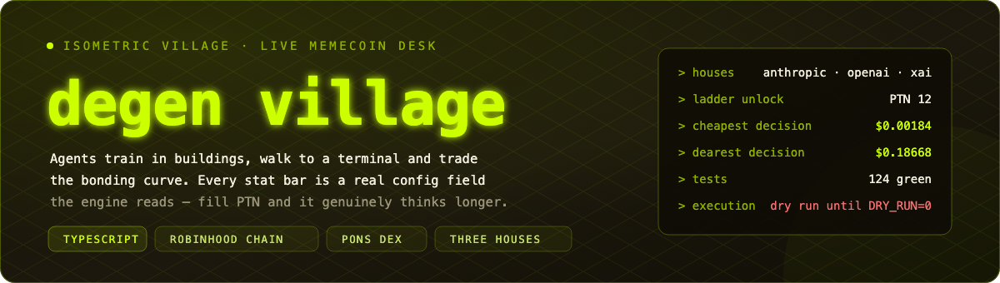

<div align="center">




[](https://github.com/zostaff/agent-arena/actions/workflows/ci.yml)

**[Roadmap](ROADMAP.md)** · **[Specs](specs/00-overview.md)** · **[Stat compiler](specs/02-stat-compiler.md)** · **[Live wires](specs/04-live.md)**

</div>

## What this is

An isometric village where AI agents train in buildings, walk to a terminal,
and trade memecoins on the Pons bonding-curve DEX (Robinhood Chain).

**Every stat bar is a real config field the engine reads.** Fill the SPD bar and
the agent's poll interval genuinely drops. Fill PTN and it genuinely reads more
candles, thinks with a bigger budget, and at 12 changes model. The village is a
config editor with a progress bar in front of it.

```bash
npm install
npm test        # 142 tests, ~1s
npm run sim     # MODE=sim — seeded, deterministic, free
npm run dev     # the village in a browser
```

## Three houses

Every agent is wired to **Anthropic**, **OpenAI** or **xAI** — chosen in the
FORGE, changed later with REWIRE. Real vendor list prices, standard tier,
checked 2026-09-06.

| House | PTN 0 → PTN 12 | $/decision at PTN 0 | at PTN 12 | jump |
|---|---|---|---|---|
| **xAI** | `grok-4.3` → `grok-4.6` | $0.00184 | $0.02414 | 13.1x |
| **Anthropic** | `claude-opus-5` → `claude-fable-5-1` | $0.01186 | $0.18668 | 15.7x |
| **OpenAI** | `gpt-5.6-terra` → `gpt-6-astra` | $0.00534 | $0.18668 | 34.9x |

A whole Grok 4.6 decision — frontier rung, 96 candles, 3000 reasoning tokens —
costs less than a quarter of an Opus 5 decision at PTN 0. GPT-6 Astra and
Fable 5.1 both bill $10/$50, so at the top they cost the same to the cent; the
difference is what you paid on the way up.

**The house changes exactly three things**: the model id on the wire, the price
of every decision, and which parameters the request may legally carry. Poll
interval, context depth, position size and slippage are identical across
houses — a test asserts it field by field, so the choice can never quietly
become a balance lever.

| Where | What it does |
|---|---|
| **FORGE** | three buttons above the strategy sliders; the compiled-config preview reprices as you click, the backtest deliberately does not move |
| **REWIRE** | 60 coins, in the agent inspector, mid-run — refused while a position is open, because the verdict that opened it came from the old house |
| **`AGENT_PROVIDERS=xai,openai`** | wires the roster in order at boot in live mode, without touching code |

Adding a fourth house is one entry in `MODEL_LADDERS`, one in `MODEL_PRICING`,
one `WireAdapter`, and one line in the router.

## The bill is subtracted

A build that clears +0.02 ETH gross while burning $9 of GPT-6 Astra lost money.
So the backtest reports **net of inference** beside gross, and the FORGE
verdict and the BUILDS board both rank on net.

```
spentEth = spentUsd / ASSUMED_ETH_USD     # one assumed price, one constant
netEth   = pnlEth - spentEth
```

The sim brain never reads a model id, so **gross is identical across houses,
tick for tick** — a test compares the whole equity array to prove it. Only the
bill moves. That is also why the FORGE can show what the same run would net on
**all three houses from a single backtest**: the backtest agent is frozen, so
`costPerDecision` is constant and the whole bill is `decisions × cost`.

## The stat compiler

```
pollIntervalMs  = max(400, 3200 - spd * 260)
ctxCandles      = min(120, 24 + ptn * 6)
thinkingBudget  = ptn >= 12 ? 3000 : ptn >= 8 ? 1500 : ptn >= 4 ? 512 : 0
positionSizeEth = base * (1 + rsk * 0.18) * (1 + level * 0.12)   clamp base * 8
slippageBps     = max(30, 160 - gas * 9)
```

PTN buys context depth and reasoning budget, **not** a better model — until
PTN 12, which unlocks the frontier rung of whichever house the agent is wired
to. That trade-off is the LAB.

## Architecture

```
                    ┌───────────────────────────┐
                    │   src/core  (zero deps)   │
                    │  config · agent · village │
                    │  market helpers · brain   │
                    └──────────┬────────────────┘
        Market + Brain injected│
              ┌────────────────┴────────────────┐
              ▼                                 ▼
   src/sim   SimMarket + heuristicBrain  src/live  PonsMarket + liveBrain
   seeded · deterministic · free         Bitquery · viem · 3 houses
                                         routed per agent by router.ts
              │                                 │
              └──────────► src/run.ts ◄─────────┘
                         MODE=sim | MODE=live
                                 │
                            src/ui  React · SVG · canvas-free
```

`src/core` imports nothing at all. That is what lets the same engine run in
node and in the browser, and what makes a 7000-tick backtest and a live session
comparable.

## Deviations from the original brief

Forced by the vendors' current APIs — sending the brief's version returns a
`400`. Full reasoning in [specs/04-live.md](specs/04-live.md).

1. **`temperature: 0` is not sent** to `claude-opus-5` or `claude-fable-5-1`.
   Sampling parameters were removed on that model family. Determinism here
   comes from `src/sim`, which never calls a live brain.
2. **`thinking.budget_tokens` is not sent.** Also rejected on both models. The
   reasoning budget PTN buys is encoded as `output_config.effort`
   (`0 → low`, `512 → medium`, `1500 → high`, `3000 → xhigh`) and still rides
   on `max_tokens` as headroom. The number the village displays and prices is
   unchanged.
3. **OpenAI rejects sampling parameters too.** `temperature`, `top_p` and
   `logprobs` were removed on `gpt-6-astra` and the GPT-5.6 family; the
   Responses API carries the budget as `reasoning.effort`.

**xAI is the one house where `temperature: 0` still works**, and it is still
sent there — the determinism the brief asked for survives on exactly one of the
three wires.

## Running it for real

The village is a static bundle: no server, no secrets in the build — live keys
only ever exist in `MODE=live` on your own machine. So the browser build is
published straight from CI.

| Piece | What it does |
|---|---|
| `.github/workflows/ci.yml` | typecheck → tests → build on every push and PR |
| `.github/workflows/pages.yml` | the same gate, then publishes `dist` to GitHub Pages |
| `src/ui/ErrorBoundary.tsx` | a crash shows the message and offers to wipe the save, instead of a white screen |
| autosave | every 240 ticks, plus a flush on `pagehide` and `visibilitychange` |

**One-time step before the first publish:** Settings → Pages → *Build and
deployment* → Source: **GitHub Actions**. The workflow asks
`configure-pages` to enable Pages itself, but on this repository the Actions
token is refused with `Resource not accessible by integration`, so the site has
to be created once by hand. Every push after that publishes on its own.

**Your village survives a reload.** Treasury, building levels, running jobs,
boosts, and every agent's stats, level, XP, house and record come back.
Open positions deliberately do not: a position is priced against a market that
no longer exists after a reload, so carrying one over would mean inventing its
P&L. RESET in the header wipes the save — two clicks, because it cannot be
undone.

A save is treated the way a model's answer is treated: as data from anywhere.
`parseSave` coerces and clamps every number, checks every id against the set
the engine knows, and refuses a save it does not recognise instead of guessing.

## Safety rails

* `decide()` **never throws**. Parse failure, bad status, timeout, transport
  error, empty content, refusal, missing key — all resolve to `SKIP`.
* `sizeEth` is clamped to `maxSizeEth` **after** parsing, every time, on every
  house. The model is never trusted on size.
* **Degrade-once.** A `400` body is *read*, not just counted: if it names a
  parameter (`reasoning_effort`, `temperature`, `store`), the request is sent
  again immediately without it, outside the retry budget. A silently dead house
  is worse than a slightly slower one.
* `execute.ts` defaults to `dryRun: true` and prints the exact call it would
  have sent. `DRY_RUN=0` is the only way off.
* A fill whose realised slippage exceeds the agent's `slippageBps` is refused,
  not eaten.

## Specs

Written so a future session can pick up any part without re-reading the code.

| Spec | Contents |
|---|---|
| [00 — Overview](specs/00-overview.md) | architecture, file map, reading order |
| [01 — Core contracts](specs/01-core-contracts.md) | `Market`, `Brain`, `Snapshot`, `Verdict`, agent states, class lenses |
| [02 — Stat compiler](specs/02-stat-compiler.md) | every formula, the three ladders, pricing, boosts, boundary table |
| [03 — Sim](specs/03-sim.md) | mulberry32, the random walk and its tuning, heuristic brain, backtest, net-of-inference |
| [04 — Live](specs/04-live.md) | all three wire contracts **and their forced deviations**, degrade-once, Bitquery queries, viem execution |
| [05 — Village economy](specs/05-village-economy.md) | buildings, costs, times, RUSH, boosts, REWIRE, treasury, fills |
| [06 — FORGE](specs/06-forge.md) | stat budget, house picker, strategy params, prompt suffix, backtest, deploy |
| [07 — UI](specs/07-ui.md) | projection, SVG anatomy, HUD, REWIRE panel, DEX overlay, palette |
| [08 — Multiplayer](specs/08-multiplayer.md) | `window.storage`, ranking on net, `BOARD_KEY` v2, load-a-rival's-build |
| [09 — Tests](specs/09-tests.md) | what each file covers and which assertions are load-bearing |

## Environment

```bash
cp .env.example .env
```

| Variable | Used by |
|---|---|
| `ANTHROPIC_API_KEY` | `src/live/brain.ts` |
| `OPENAI_API_KEY` | `src/live/providers.ts` — only if an agent is wired to OpenAI |
| `XAI_API_KEY` | `src/live/providers.ts` — only if an agent is wired to xAI |
| `AGENT_PROVIDERS` | `src/run.ts` — e.g. `xai,openai`; wires the roster in order |
| `BITQUERY_TOKEN` | `src/live/pons.ts` |
| `RH_RPC_URL`, `RH_PRIVATE_KEY`, `PONS_ROUTER` | `src/live/execute.ts` |
| `DRY_RUN` | `src/live/execute.ts` — anything but `0` keeps it dry |
| `MODE`, `SEED`, `TICKS` | `src/run.ts` |

## What is next

Everything planned, shipped and deliberately refused lives in
**[ROADMAP.md](ROADMAP.md)** — including the honest note that the OpenAI and
xAI wires are typed and tested but have not yet answered for real.

## Licence

MIT.

---

<div align="center">
<sub><b>no autopilot · dry run by default · every bar is a field the engine reads</b></sub>
</div>
