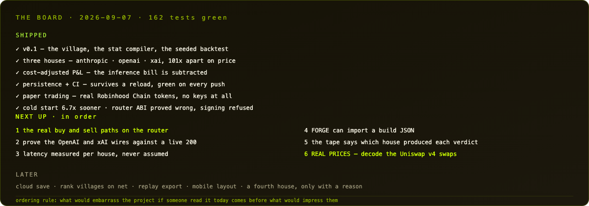

  

# Roadmap

**Every improvement lands here first.** A change that is worth making is worth
one line in *Next up* before it is worth a commit; a change that shipped moves
to *Shipped* with its date, its hash, and a **For a post** block — the checked
facts and numbers behind it. If something was considered and rejected, it goes
to *Not doing* with the reason, so the same idea does not get re-litigated in
six months.

Nothing in a *For a post* block is aspirational. If a number is not measured
yet, it is written as the limit instead of as the achievement.

The ordering rule for *Next up*: **what would embarrass the project if someone
read the code today** comes before what would impress them — with one standing
exception: something that spoils the first thirty seconds for a new player
outranks everything, because nobody reaches the good part through a bad start.

---

## Shipped

Every entry carries a **For a post** block: facts and numbers that are already
checked, so writing an update is a matter of picking which line to lead with —
never of inventing something that merely sounds like progress. Each block ends
with the honest limit, because an update that names its own gap is the one
people believe.

Where it stands today: **7,633 lines of TypeScript across 32 files, 1,967 lines
of tests (156 green), 1,082 lines of spec** — typechecked, tested and built by
CI on every push. Three modes: seeded sim, **paper on real chain tokens**, and
live.

### 2026-09-07 · Cold start fixed, and a router ABI that was wrong all along — [`ca97ddd`](https://github.com/zostaff/agent-arena/commit/ca97ddd)

**What changed.** Two roadmap items in one pass: a new agent now trades before
it trains, and `execute.ts` refuses to sign any call whose selector is not in
the deployed router's bytecode. 6 new tests.

**For a post**

* **The first trade came 6.7x sooner.** First decision moved from tick 497 to
  **74**, first fill from 515 to **207** — measured, not estimated. An agent
  used to start its life owing a training session, so a fresh village spent its
  opening minutes doing chores while someone watched.
* **Reading the deployed router found the ABI had been wrong from day one.**
  `eth_getCode` on `0xe33e…2948` (4,416 bytes) does not contain the selector
  for `buy(address,uint256,uint256)` — the signature pinned in the code since
  the first commit. `DRY_RUN=0` would have reverted on the very first trade.
  Nobody noticed because nothing had ever tried to send.
* The router's real buy is **`buy(uint256,uint256,address)`** — a different
  argument order — and no `sell` selector matches any plausible signature,
  which fits Pons v2 settling through Uniswap v4 rather than through the
  router.
* **The fix is a refusal, not a guess.** One `eth_getCode` before signing; a
  call whose selector cannot dispatch is refused. Guessing at argument order is
  the single mistake here that costs real money, so a selector *match* does not
  unlock anything either — the refusal stands until an order is confirmed
  against a real trade. A miss, though, is proof.
* `npm run chain` prints the gate in four lines: `pinned buy ABSENT — would
  revert`, `pinned sell ABSENT`, `observed buy present (argument order
  unconfirmed)`, `safe to send NO`.
* **The honest limit:** this makes execution *safe*, not *working*. The real
  buy path is still unwritten, and the sell path is still unknown.

### 2026-09-07 · Paper trading on real Robinhood Chain tokens — [`34e6ecc`](https://github.com/zostaff/agent-arena/commit/34e6ecc)

**What changed.** A third mode. `npm run paper`, or the PAPER switch in the
header: the bots trade the tokens launching on Robinhood Chain right now, read
from the free public RPC. New `src/live/rpc.ts` (raw JSON-RPC, Pons log
decoding), `src/paper/market.ts`, a live-launch panel in the DEX, `npm run
chain`, and two new specs. 14 new tests.

**For a post**

* **No key, no indexer, no wallet.** The Robinhood Chain public RPC is free and
  CORS-open, so this runs in a terminal and in the browser build alike. That is
  the whole point: someone can watch the bots trade without signing up for
  anything.
* The chain is *busy*: **173 token launches in an eight-minute window** on
  2026-09-07. Tokens arrive seconds apart — `$SLOPNALD`, `$HORMUZ`, `$PERONA`,
  `$VLAD TENEV`. The bots trade whatever launched in the last quarter hour.
* **What is real is labelled field by field.** Identity, symbol and age come
  from `eth_getLogs` and `symbol()`; price and book are simulated, because Pons
  v2 settles through Uniswap v4 and that swap decoding is not written yet. The
  DEX prints `identity chain · price sim · book sim · fills paper` under every
  chart. A paper P&L on a real ticker is easy to mistake for a real one — the
  label is the feature, not decoration.
* **The village will not invent a ticker.** The old code fell back to a
  hard-coded `$RUG` when the market had named no pairs yet; in paper mode that
  means trading something that does not exist on chain. It now skips the cycle.
* **Two bugs only a browser could find.** `globalThis.fetch` called as a bare
  reference throws *Illegal invocation* in Chrome and works fine in Node. And a
  burst of a dozen `eth_call`s behind a `getLogs` came back empty against the
  shared public RPC, so every token rendered as its address — paced at 70ms,
  and a failed symbol is never cached, so the next refresh retries it.
* Same token, same tape, on any machine: each price path is seeded from the
  token's own address.
* **The honest limit:** prices are simulated. This is a real universe and a
  real clock, not a real market — and it says so on screen rather than in a
  footnote.

*The DEX at 03:00 on 2026-09-07: `live`, chain 4663, head 56,388,633, and six
tokens that had existed for seconds. Every address is real and clickable in a
block explorer; the chart above them is not.*

### 2026-09-07 · The village survives a reload, and CI publishes it — [`01d62db`](https://github.com/zostaff/agent-arena/commit/01d62db)

**What changed.** `save()` / `restore()` on the village, a hostile-input
`parseSave`, autosave every 240 ticks with a flush on tab hide, a two-click
RESET, an error boundary, and two GitHub Actions workflows: `ci.yml`
(typecheck → test → build on every push and PR) and `pages.yml` (same gate,
then publish). 9 new tests.

**For a post**

* **Two hours of upgrades used to die on a stray Cmd-R.** Now treasury,
  building levels, running jobs, boosts and every agent's stats, level, XP,
  house and record come back.
* **What deliberately does not come back: open positions.** A position is
  priced against a market that no longer exists after a reload, so carrying one
  over would mean inventing its P&L. The trade never closed, so it never
  counted — unrealised P&L is discarded, not banked.
* A save is treated exactly like a model's answer: **data from anywhere.**
  Every number coerced and clamped, every id checked against the set the engine
  knows, unknown buildings and boosts dropped, an unrecognised version refused
  rather than guessed at. One test feeds it a hostile save with `spd: 999`,
  `cls: "GODMODE"` and a negative treasury and asserts what comes out.
* **Driving it in a real browser caught a real bug.** RESET cleared the save
  and reloaded — and the reload fired `pagehide`, which wrote the village
  straight back. Watching the tick counter go 36 → 28 instead of 36 → 0 is what
  exposed it; a latch now suppresses the flush while a wipe is in flight. Unit
  tests would never have found that one: the bug lived in the browser's
  lifecycle, not in the engine.
* **CI is green on every push**: typecheck → 142 tests → build, in about 40
  seconds. The Pages workflow runs the same gate before anything reaches a
  public URL.
* **The honest limit:** the save is per browser. There is no account, no cloud
  slot, and clearing site data still clears the village.

### 2026-09-06 · Cost-adjusted P&L — [`07e37de`](https://github.com/zostaff/agent-arena/commit/07e37de)

**What changed.** The inference bill is subtracted from the result. `netEth =
pnlEth - spentUsd / ASSUMED_ETH_USD`; net sits beside gross everywhere; the
FORGE verdict and the BUILDS board rank on net (`BOARD_KEY` → `dv_board_v2`);
one backtest now prices the same run on all three houses; the agent inspector
gained a net-of-inference row. 9 new tests.

**For a post**

* A build that clears **+0.02 ETH gross while burning $9 of GPT-6 Astra lost
  money.** That sentence is the whole feature.
* Gross alone was defensible while every agent billed **$0.01186** a decision.
  With three houses **100x apart** on price it became a lie by omission.
* **One run, three prices.** The backtest agent is frozen, so cost per decision
  is constant and the whole bill is `decisions × cost` — all three houses get
  priced from a single simulation instead of three.
* The leaderboard key moved to v2 rather than migrating old rows: entries
  ranked on gross **are not comparable** to entries ranked on net, and pre-v2
  rows show their gross with an asterisk instead of pretending the bill was
  zero.
* One assumed number in the whole engine: **ETH at $2,500** (spot was $2,506
  that day). It lives alone in one constant, and everything derived from it is
  labelled *net*.
* **The honest limit:** this is a seeded simulation, not a live P&L. It
  measures builds against each other, not the market.

*The FORGE: 20 stat points, the house the build runs on, and a compiled config
that reprices as you click. The backtest underneath reports NET beside gross.*

### 2026-09-06 · Three houses — [`8534cae`](https://github.com/zostaff/agent-arena/commit/8534cae)

**What changed.** Every agent is wired to Anthropic, OpenAI or xAI. Ladder,
pricing and wire contract per house; FORGE picker; REWIRE for 60 coins;
`AGENT_PROVIDERS`; degrade-once on a rejected parameter. 29 new tests.

**For a post**

* Three houses, six models, one unlock point: **PTN 12** opens the frontier
  rung on all three ladders.
* The price spread is the game: **$0.00184** a decision on Grok 4.3 against
  **$0.18668** on GPT-6 Astra — **101x**. A whole frontier Grok 4.6 decision
  (96 candles, 3000 reasoning tokens) costs **less than a quarter** of an
  Opus 5 decision at the bottom of its ladder.
* GPT-6 Astra and Fable 5.1 both bill **$10/$50** per million, so at the top
  they cost the same to the cent. The difference is what you paid on the way up.
* **The house changes exactly three things**: the model id on the wire, the
  price per decision, and which parameters the request may legally carry. A
  test asserts poll interval, context depth, size and slippage are identical
  across houses — so it can never quietly become a balance lever.
* **xAI is the only house that still accepts `temperature: 0`.** OpenAI removed
  sampling parameters on GPT-6 Astra and the GPT-5.6 family; Anthropic removed
  them on Opus 5 and Fable 5.1. The determinism the original brief asked for
  survives on exactly one of the three wires.
* **Degrade-once:** a 400 body is read, not just counted. If it names a
  parameter, the request goes again immediately without it, outside the retry
  budget. A silently dead house is worse than a slightly slower one.
* **The honest limit:** the OpenAI and xAI wires are typed and tested against
  fixtures. Neither has answered this code for real yet — that is item 1 in
  *Next up*, and it stays worded that way until it has.

### 2026-09-06 · DEGEN VILLAGE v0.1 — [`7b9d892`](https://github.com/zostaff/agent-arena/commit/7b9d892)

**What changed.** The whole thing: stat compiler, village economy, agent state
machine, seeded sim, deterministic backtest, live Anthropic brain, Bitquery
market, viem execution in dry run, isometric SVG UI, FORGE, board. 95 tests.

**For a post**

* **Every stat bar is a real config field the engine reads.** Fill SPD and the
  poll interval genuinely drops: `max(400, 3200 - spd × 260)`. Nothing on the
  screen is decorative.
* `src/core` **imports nothing at all** — that is what lets the same engine run
  in node and in a browser, and what makes a 7,000-tick backtest and a live
  session comparable.
* **Two runs of the same build return byte-identical numbers.** That is what
  makes the leaderboard a leaderboard and not a lottery.
* `decide()` **never throws.** Parse failure, bad status, timeout, transport
  error, empty content, refusal, missing key — all of it resolves to SKIP.
* The model is **never trusted on size**: `sizeEth` is clamped after parsing,
  every time, including on the sell path.
* **The honest limit:** execution defaults to `dryRun: true` and prints the
  call it would have sent. It has never signed a transaction.

*Four agents, eight buildings, one terminal. The left panel is the whole idea:
stat bars on top, the config they compile to underneath.*

---

## Next up

### 2. The real buy and sell paths

The selector preflight proved the pinned ABI cannot dispatch and now refuses to
sign — safe, but not working. `buy(uint256,uint256,address)` exists on the
router with an unconfirmed argument order, and no `sell` selector was found at
all.

**Done means:** the argument order is confirmed from a real buy transaction's
calldata on chain, the sell path is located (router, curve engine, or the v4
PoolManager), both are pinned with the transaction hash that proved them, and
the preflight goes green on its own rather than by being told to.

### 3. Prove the two new wires against a live 200

`providers.test.ts` drives OpenAI and xAI through fixtures. Neither has ever
answered this code for real. Everything about the request shape is *inferred
from vendor docs*, and docs and deployments disagree all the time — that is
precisely why degrade-once exists.

**Done means:** one recorded dry-run session per house, the `onTrace` output
pasted into `specs/04-live.md`, and any shape correction the real response
forced. Until then the honest claim is "typed and tested", not "working".

### 4. Latency measured per house, never assumed

`BrainTrace.ms` is recorded and then thrown away. Round-trip time is a real
difference between houses and it belongs in the HUD — as a *measurement*, with
a sample count.

**Done means:** rolling median ms per house in the inspector, labelled with `n`.
It must not feed the stat compiler: SPD is the poll interval the player bought,
not a vendor's mood.

### 5. FORGE can import a build JSON

EXPORT JSON exists; there is no way back in. A build shared outside the board
is currently a screenshot.

**Done means:** a paste box that validates and loads, rejecting unknown
providers to the default rather than compiling an undefined ladder.

### 6. The DEX overlay says which house produced each verdict

The trade tape shows the reason, not the brain. With three houses in one
village that is the most interesting column on the screen and it is missing.

### 7. Real prices: decode the Uniswap v4 swaps

The single biggest gap in the project. Paper mode reads the token universe from
chain and then simulates the price, because Pons v2 settles through Uniswap v4:
a trade is a `Swap` on the PoolManager keyed by pool id, not an event on the
Pons router. Everything downstream — the tape, the candles, the P&L — is real
the moment this is decoded.

**Done means:** the PoolManager address and pool id derivation are pinned in
`specs/11-chain-feed.md`, `RpcMarket` serves OHLC built from real swaps, and
`Snapshot.provenance.price` flips from `sim` to `chain`. Nothing else in the
codebase has to change — that one label is wired through the UI already.

---

### 8. A cloud save slot, or an honest note that there isn't one

The village now persists per browser. Open it on a phone and it is a different
village, and clearing site data still wipes it. `window.storage` already has a
shared mode — the board uses it — so the machinery exists.

**Done means:** either a per-owner village slot that follows the player, or one
line in the UI saying plainly that progress is local to this browser. The
second is a fifteen-minute job and is better than an unkept implication.

### 9. Finish the publish

`pages.yml` builds and is ready to deploy; the site itself still has to be
created once in Settings → Pages (Source: GitHub Actions), because the Actions
token is refused with `Resource not accessible by integration` when it tries to
create it. Until that switch is flipped the pages workflow will keep failing on
every push, which is exactly the kind of permanent red that people learn to
ignore.

**Done means:** the switch is flipped and the live URL is in the README — or,
if it stays off, `pages.yml` drops to `workflow_dispatch` so the failure is not
a standing one.

## Later

* Rank rival villages by cost-adjusted net, not gross — the BUILDS board now
  does it, the VILLAGES board still ranks on gross session P&L.
* The FORGE and DEX overlays assume a wide viewport: at ~1200px the right-hand
  column is the first thing to suffer. Noticed while screenshotting the net
  cells on 2026-09-06; not urgent, but it is a real edge and it is written down
  rather than forgotten.
* Replay export: a seed plus a build is already a reproducible run; make it a
  shareable file.
* Mobile layout for the village scene (the HUD assumes a wide viewport).
* A fourth house — only when there is a reason beyond "it exists". Adding one
  is one entry in `MODEL_LADDERS`, one in `MODEL_PRICING`, one `WireAdapter`
  and one router line; the cost is keeping another price table honest.

---

## Not doing

* **Making the house a balance lever.** The provider changes the model id, the
  price and the legal wire parameters — nothing else. A test asserts poll
  interval, context depth, size and slippage are identical across houses. If
  that ever changes it will be a deliberate, argued decision, not a nerf.
* **Retuning `src/sim/market.ts` to make backtests look better.** The seed
  replays a world; changing the world invalidates every published build.
* **Autopilot with real funds.** `dryRun: true` is the default and `DRY_RUN=0`
  stays the only way off, typed by a human who meant it.
* **Trusting the model on size.** `sizeEth` is clamped to `maxSizeEth` after
  parsing, every time, on every house, including the SELL path.
