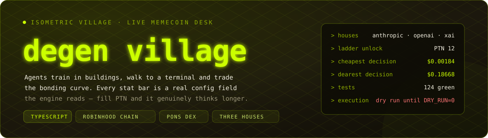

  

# Roadmap

**Every improvement lands here first.** A change that is worth making is worth
one line in *Next up* before it is worth a commit; a change that shipped moves
to *Shipped* with its date and hash. If something was considered and rejected,
it goes to *Not doing* with the reason, so the same idea does not get
re-litigated in six months.

The ordering rule for *Next up*: **what would embarrass the project if someone
read the code today** comes before what would impress them.

---

## Shipped

| Date | What | Commit |
|---|---|---|
| 2026-09-06 | **Three houses.** Agents wired to Anthropic, OpenAI or xAI; ladder, pricing and wire contract per house; FORGE picker, REWIRE for 60 coins, `AGENT_PROVIDERS`; degrade-once on a rejected parameter; 29 new tests. | `8534cae` |
| 2026-09-06 | **DEGEN VILLAGE v0.1.** Stat compiler, village economy, agent state machine, seeded sim + deterministic backtest, live Anthropic brain, Bitquery market, viem execution in dry run, isometric SVG UI, FORGE, board. 95 tests. | `7b9d892` |

---

## Next up

### 1. Prove the two new wires against a live 200

`providers.test.ts` drives OpenAI and xAI through fixtures. Neither has ever
answered this code for real. Everything about the request shape is *inferred
from vendor docs*, and docs and deployments disagree all the time — that is
precisely why degrade-once exists.

**Done means:** one recorded dry-run session per house, the `onTrace` output
pasted into `specs/04-live.md`, and any shape correction the real response
forced. Until then the honest claim is "typed and tested", not "working".

### 2. Cost-adjusted P&L

The village already tracks `spentUsd` per agent. The backtest does not price a
single decision — it reports gross P&L only. That was defensible when every
agent burned the same $0.01186; with houses 100x apart on price it is a lie by
omission. A build that scores +0.02 ETH on GPT-6 Astra may be losing money.

**Done means:** `backtest.ts` reports net-of-inference P&L alongside gross, the
FORGE shows both, and the BUILDS board ranks by net. Bump `BOARD_KEY` — old
entries are not comparable.

### 3. Village state survives a reload

`storage.ts` persists the board and the player identity. The village itself —
buildings, treasury, levels, deployed builds — dies on refresh. Two hours of
upgrades vanish on a stray Cmd-R, which makes the whole progression feel unsafe
to invest in.

**Done means:** the village serializes to `window.storage` on a debounce and
rehydrates on boot, with a version tag so a schema change resets cleanly
instead of crashing.

### 4. `execute.ts` verified against the real router ABI before anyone unsets `DRY_RUN`

The dry-run path prints the exact call it would send. Nobody has checked that
call against the deployed Pons router ABI on chain 4663. `DRY_RUN=0` is one
environment variable away from being someone's real money.

**Done means:** the ABI is read from chain, the encoded calldata for a known
swap is asserted in a test, and the README says plainly which router address
was verified and when.

### 5. Latency measured per house, never assumed

`BrainTrace.ms` is recorded and then thrown away. Round-trip time is a real
difference between houses and it belongs in the HUD — as a *measurement*, with
a sample count.

**Done means:** rolling median ms per house in the inspector, labelled with `n`.
It must not feed the stat compiler: SPD is the poll interval the player bought,
not a vendor's mood.

### 6. FORGE can import a build JSON

EXPORT JSON exists; there is no way back in. A build shared outside the board
is currently a screenshot.

**Done means:** a paste box that validates and loads, rejecting unknown
providers to the default rather than compiling an undefined ladder.

### 7. The DEX overlay says which house produced each verdict

The trade tape shows the reason, not the brain. With three houses in one
village that is the most interesting column on the screen and it is missing.

---

## Later

* Rank rival villages by cost-adjusted net, not gross.
* Replay export: a seed plus a build is already a reproducible run; make it a
  shareable file.
* Mobile layout for the village scene (the HUD assumes a wide viewport).
* A fourth house — only when there is a reason beyond "it exists". Adding one
  is one entry in `MODEL_LADDERS`, one in `MODEL_PRICING`, one `WireAdapter`
  and one router line; the cost is keeping another price table honest.

---

## Not doing

* **Making the house a balance lever.** The provider changes the model id, the
  price and the legal wire parameters — nothing else. A test asserts poll
  interval, context depth, size and slippage are identical across houses. If
  that ever changes it will be a deliberate, argued decision, not a nerf.
* **Retuning `src/sim/market.ts` to make backtests look better.** The seed
  replays a world; changing the world invalidates every published build.
* **Autopilot with real funds.** `dryRun: true` is the default and `DRY_RUN=0`
  stays the only way off, typed by a human who meant it.
* **Trusting the model on size.** `sizeEth` is clamped to `maxSizeEth` after
  parsing, every time, on every house, including the SELL path.
